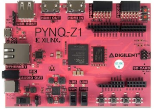
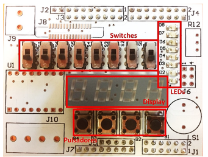

# VHDL_samples

Some VHDL samples programmed throughout my Digital Electronics course.

Every sample was designed to be run on a Zynq-7000 FPGA, embedded in a Pynq-Z1 board from Digilent, which can be seen down below, and programmed through Vivado Design Suite.

Also, an expansion shield was developed by the teachers of the course, adding input and output functionalities to be managed by our designs.

