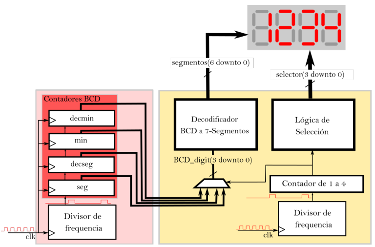

# Digital Stopwatch

Seconds and minutes elapsed since the board reboot will be counted.

- Internal clock frequency: 125 MHz
- Clock counting frequency: 1 Hz
- Displays refresh frequency: 4 KHz

Implementation was divided between two stages, first programming and verifying a counting module through a Test Bench simulation in Vivado; 
secondly adding a module to manage displays, and testing it directly on hardware by generating a properly bitstream.

A constraints file is also provided, although it is obviously specifical for the particular design of the given expansion shield.

The implemented architecture can be seen down below.

