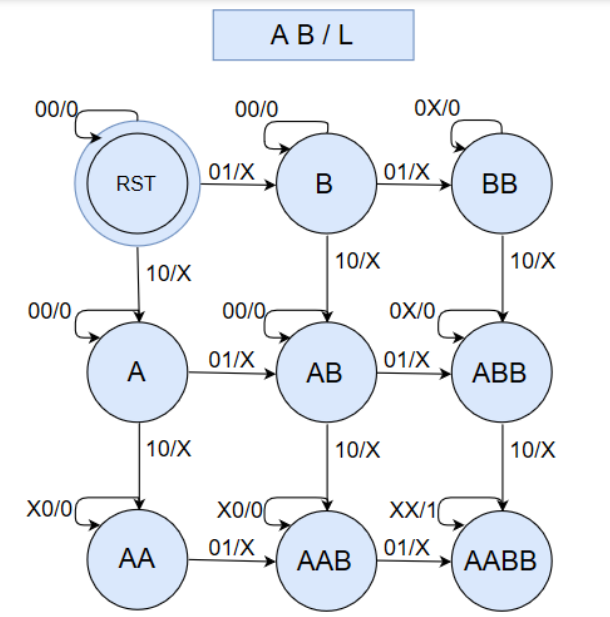
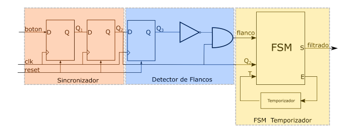
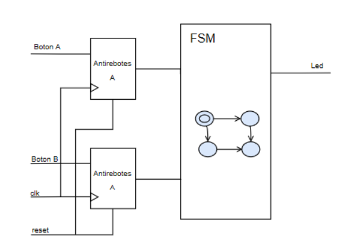

# Electronic Locker

A classical sequence detector emulating the operation of an electronic locker. As it is to be implemented in a physical system, with real switches,
besides the finite state machine for the sequence detection, debouncing circuits must be implemented for both inputs.

Down below can be seen the state diagram for the finite state machine. There is only one led output, which signals when the sequence is correct and the locker can be 
opened. The led shuts down and the locker closes by clicking the reset button of the board.

Also, this is the architecture design employed for the debouncing modules.

The structural description of the whole system is then as follows:

Implementation was divided between two stages, first programming and verifying the debouncing module through Test Bench simulation in Vivado; secondly adding the FSM and testing it directly on hardware by generating its properly bitstream.

